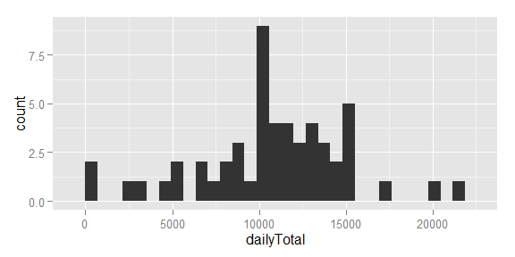
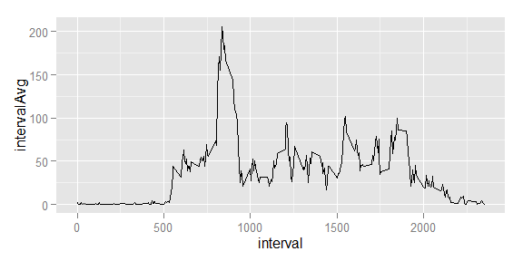

# Reproducible Research: Peer Assessment 1
Rob Rolleston  


## Loading and preprocessing the data
First, load the required libaries.  
Second, read the raw ZIP file, convert the date strings to date objects, and leave missing values as "NA".  
Finally, convert the data table into a dplyr table.
The data will reside in a dplyr table: "data".

```r
library(ggplot2, quietly = TRUE, verbose=FALSE, warn.conflicts = FALSE)
library(dplyr, quietly = TRUE, verbose=FALSE, warn.conflicts = FALSE)

data <- read.csv(unz("activity.zip", "activity.csv"), stringsAsFactors = FALSE)
data$date <- as.Date(data$date, format="%Y-%m-%d")
data <- tbl_df(data)
```


## What is mean total number of steps taken per day?
Note: *In this analysis, the missing values are ignored.*

```r
dataByDay <- data %>% filter(!is.na(steps)) %>% group_by(date) %>% summarize(dailyTotal=sum(steps))
dailyMean <- mean(dataByDay$dailyTotal)
dailyMedian <- median(dataByDay$dailyTotal)
```
### Histogram of Daily Steps

```r
ggplot(dataByDay, aes(dailyTotal)) + geom_histogram()
```

 

### Mean and median
The mean total number of steps is 10766.2, and the median is 10765.

## What is the average daily activity pattern?
Note: *In this analysis, the missing values are ignored.*

```r
dataByInterval <- data %>% filter(!is.na(steps)) %>% group_by(interval) %>% summarize(intervalAvg=mean(steps))
intervalMax <- max(dataByInterval$intervalAvg)
topInterval <- top_n(dataByInterval, 1, intervalAvg)
```

```r
ggplot(dataByInterval, aes(interval, intervalAvg)) + geom_line()
```

 

Interval # 835 has the highest average, with a value of 206.1698113

## Imputing missing values


## Are there differences in activity patterns between weekdays and weekends?


