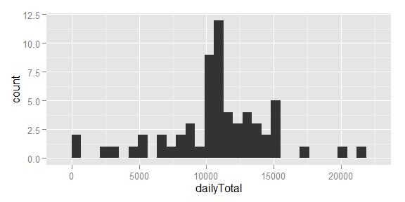
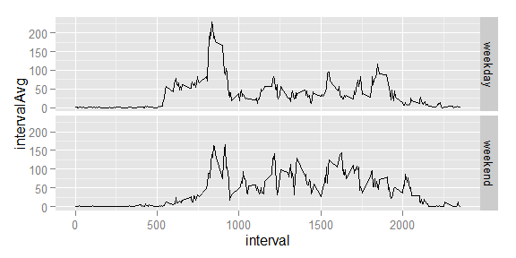

# Reproducible Research: Peer Assessment 1
Rob Rolleston  


## Loading and preprocessing the data
First, load the required libaries.  
Second, read the raw ZIP file, convert the date strings to date objects, and leave missing values as "NA".  
Finally, convert the data table into a dplyr table.
The data will reside in a dplyr table: "data".

```r
library(ggplot2, quietly = TRUE, verbose=FALSE, warn.conflicts = FALSE)
library(dplyr, quietly = TRUE, verbose=FALSE, warn.conflicts = FALSE)

data <- read.csv(unz("activity.zip", "activity.csv"), stringsAsFactors = FALSE)
data$date <- as.Date(data$date, format="%Y-%m-%d")
data <- tbl_df(data)
```


## What is mean total number of steps taken per day?
Note: *In this analysis, the missing values are ignored.*

```r
dataByDay <- data %>% filter(!is.na(steps)) %>% group_by(date) %>% summarize(dailyTotal=sum(steps))
dailyMean <- mean(dataByDay$dailyTotal)
dailyMedian <- median(dataByDay$dailyTotal)
```
### Histogram of Daily Steps

```r
ggplot(dataByDay, aes(dailyTotal)) + geom_histogram()
```

 

### Mean and median
The mean total number of steps is 10766.2, and the median is 10765.

## What is the average daily activity pattern?
Note: *In this analysis, the missing values are ignored.*

```r
dataByInterval <- data %>% filter(!is.na(steps)) %>% group_by(interval) %>% summarize(intervalAvg=mean(steps))
intervalMax <- max(dataByInterval$intervalAvg)
topInterval <- top_n(dataByInterval, 1, intervalAvg)
```

```r
ggplot(dataByInterval, aes(interval, intervalAvg)) + geom_line()
```

 

Interval # 835 has the highest average, with a value of 206.1698113

## Imputing missing values

```r
dataNA <- data %>% filter(is.na(steps))
countNA <- nrow(dataNA)
```
The original data set has 2304 missing vlaues for steps.  These missing values will be imputed by

1. split the original data set into two parts, those rows without and with NA values
    + NOTE: the unknown values are captured above in the dataframe `dataNA`
2. using the known values, calcualte the average steps per 5-min interval
    + NOTE: this was already done above, to create the dataframe `dataByInterval`
3. use the average number of steps (rounded) from the known data to replace the NA for the corresponding 5-min interval
4. create a complete data frame (`dataImputed`) with no missing values by `bind_rows` of the two data frames


```r
dataKnown <- data %>% filter(!is.na(steps))
dataKnownByInterval <- dataKnown %>% group_by(interval) %>% summarize(intervalAvg=mean(steps))
dataNAImputed <- left_join(dataNA, dataKnownByInterval, by = "interval")
dataNAImputed$steps <- round(dataNAImputed$intervalAvg)
dataNAImputed <- select(dataNAImputed, -intervalAvg)
dataNew <- bind_rows(dataNAImputed, dataKnown) %>% arrange(date, interval)
```

This new data set indeed has 17568 rows, the same as hte orignal data set with 17568 rows.
There are 0 NA values.

### Histogram of Daily Steps using imputed data

```r
dataNewByDay <- dataNew %>% filter(!is.na(steps)) %>% group_by(date) %>% summarize(dailyTotal=sum(steps))
dailyMeanNew <- mean(dataNewByDay$dailyTotal)
dailyMedianNew <- median(dataNewByDay$dailyTotal)
```


```r
ggplot(dataNewByDay, aes(dailyTotal)) + geom_histogram()
```

 

### Mean and median
Using the imputed data, the mean total number of steps is 10765.6, and the median is 10762.  
These values differ from the orginal data set (where the NAs were dropped) by mean: -0.5 and median: -3.

**Summary** Imputing the missing data resulted in more total counts in the histogram, with a small visible change in appearance.  Both the mean and median decreased slightly. 


## Are there differences in activity patterns between weekdays and weekends?

```r
weekendAbrev <- c("Sat", "Sun")
dataNew$Day <- weekdays(dataNew$date, abbreviate=TRUE)
dataNew$dayType <- factor(ifelse(dataNew$Day %in% weekendAbrev, 'weekend', 'weekday'))

dataNewByDaytypeByInterval <- dataNew %>% group_by(dayType,interval) %>% summarize(intervalAvg=mean(steps))
```

```r
ggplot(dataNewByDaytypeByInterval, aes(interval, intervalAvg)) + geom_line() + facet_grid(dayType~.)
```

 


